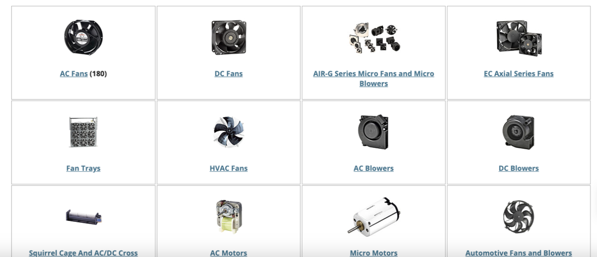

# Web Services - Final Exam

This template repository is the starter project for Web Services final exam. Written in HTML/CSS/JavaScript/EJS/Node.js/Express.js.

### Question(s)

Create a Product and Quotes page (a single page is enough) that has the following functionalities:

- **(%8)** A list of random items from an ecommerce product API (7 items)
- **(%8)** A list of random quotes (7 items) from another API
- **(%8)** Use the given API (or any other Ecommerce/Quotes API) to get the details
- **(%6)** Professional-looking User Interface (UI)

Example API 1 -> https://rapidapi.com/letscrape-6bRBa3QguO5/api/real-time-product-search/

Example API 2 -> https://dummyjson.com/quotes/

Note:

- The list of items should be fetched from the APIs.
- Make sure to include screenshots of the final result in your repo
- Show the items in a component-based approach e.g. as follows:

